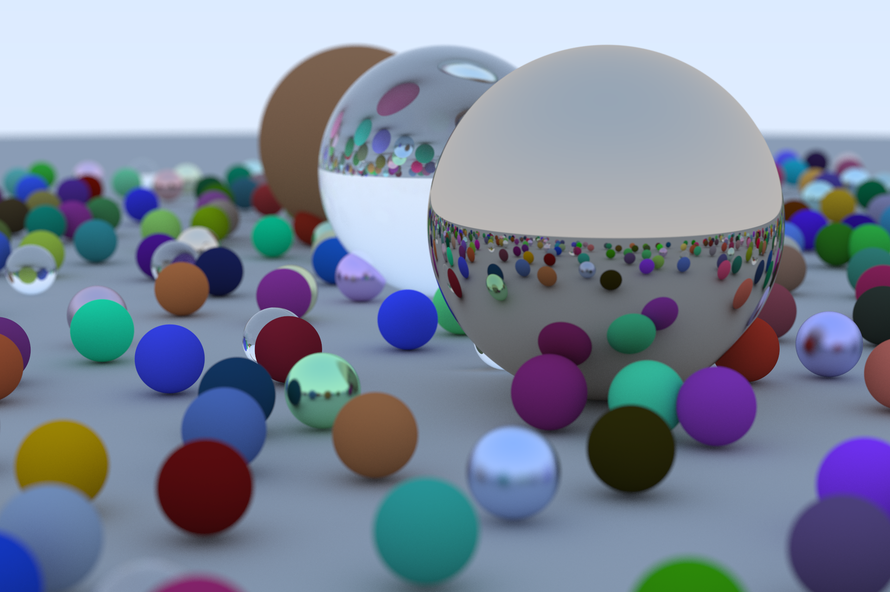

# Ray-Tracing-in-One-Weekend

My first raytracing engine based on the Raytracing in One Weekend book series by Peter Shirley. Be sure to check out their books and code. **All credit goes to them!**

Resources:

- [_Ray Tracing in One Weekend_](https://raytracing.github.io/books/RayTracingInOneWeekend.html)
- [_Ray Tracing: The Next Week_](https://raytracing.github.io/books/RayTracingTheNextWeek.html)
- [_Ray Tracing: The Rest of Your Life_](https://raytracing.github.io/books/RayTracingTheRestOfYourLife.html)
- [_Ray Tracing Git Repository & Source Code](https://github.com/RayTracing/raytracing.github.io)

## Building:

If you want to experiment with this code, follow these instructions:

First, clone this git repository:
```console
$ git clone https://github.com/Spydr06/Ray-Tracing-in-One-Weekend.git rtweekend
$ cd rtweekend
```

Then, build the executable:
```console
$ make
```

To render an image, use this command:
```console
$ bin/raytracing > img.ppm
```

The output file (here `img.ppm`) is in the `.PPM` image format. Converting this to a regular `.png` file can be done using an image editor like GIMP or using Imagemagick right in the terminal:
```console
$ convert img.ppm img.png
```

To change the rendered scene, edit the code in `main.cpp`.

## Renders:

### Render at the end of Ray Tracing in One Weekend



## License:

This code is licensed under the MIT License.